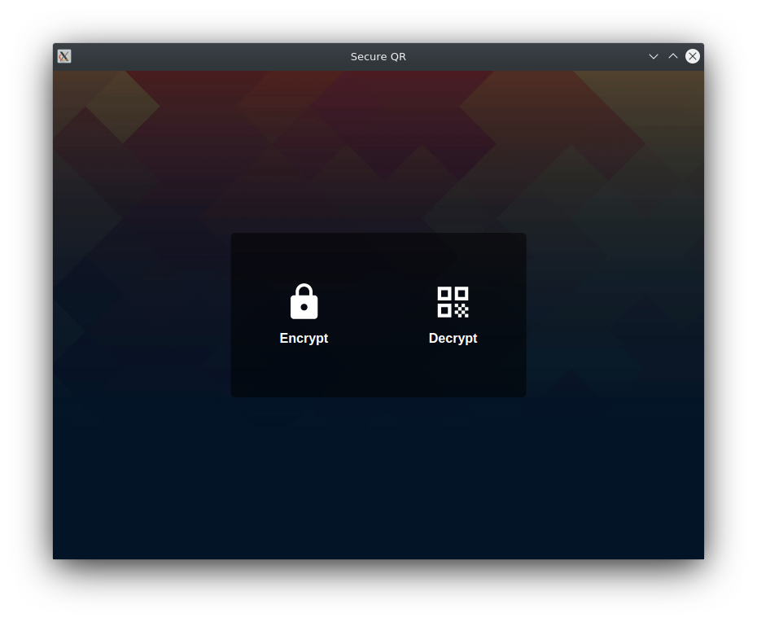
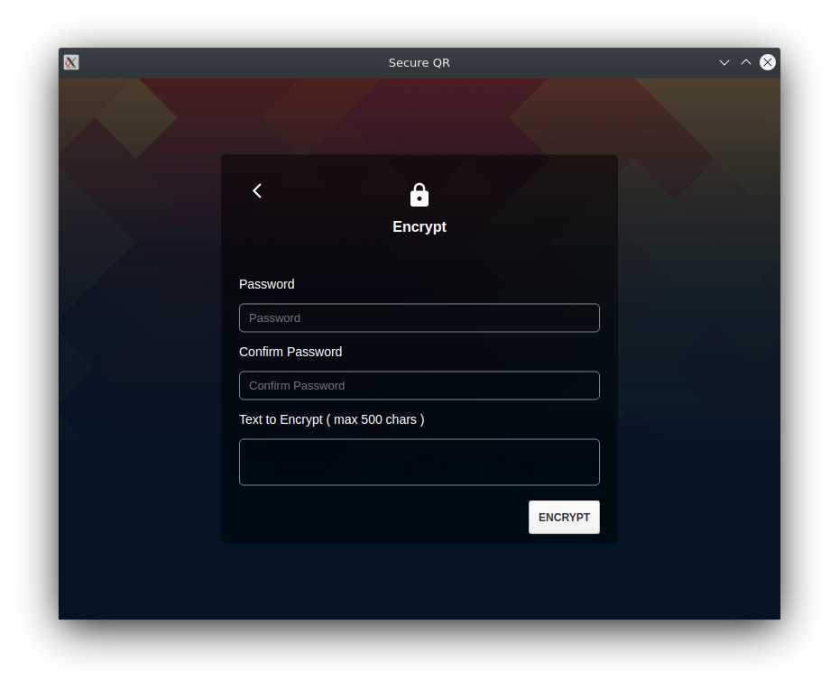
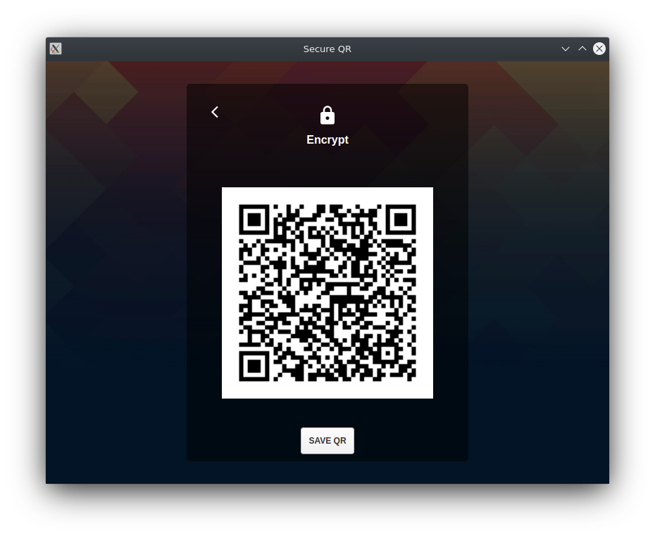
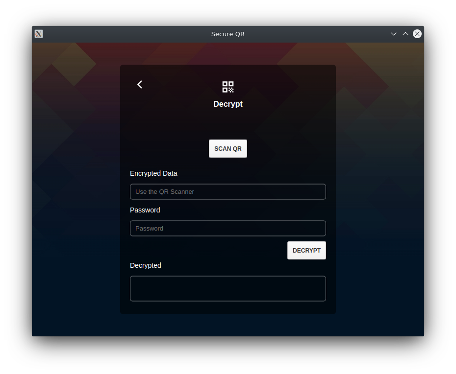

# Secure QR
### Cross Platform Desktop app for generating encrypted QR Codes and decrypting

 
The application provides a secure way for storing text data, the goal of this app is to give the users the option to store valuable information (Passwords, Seeds etc) in plain sight.

The application is built using ElectronJS to provide cross platform compatibility, it has a simple UI to make it very simple and easy to use, QR Codes are encrypted using AES-256-CBC, the key is derived using PBKDF2-SHA256.

#### Suggested usage steps
1. Make a fresh bootable linux usb drive, include the app on the drive.
1. Boot an offline PC with the usb drive.
    1. Encrypting data
        1. Generate your QR and print it.
        1. Distribute your QR code in multiple locations for redundancy.
        1. Remember/Write your password and distribute to close people.
    2. Decrypting data
        1. Attach a webcam to your computer to scan the QR.
        1. Enter your password.
        1. View the encrypted text.

_Note: You can use your daily computer and just encrypt/decrypt your data there but it's best to use fresh OS on an offline PC to avoid possible leaks from your daily computer._

#### Screenshots
</img> </img> </img> </img> 

#### Bug / Feature Request
If you find a bug, or want a new feature added, please submit it on the [Github Issues](https://github.com/bkmaverick/secureqr/issues).

#### Running the application
You can find prebuilt packages under [Github Releases](https://github.com/bkmaverick/secureqr/releases), if you want to run from source code you can do that as well by installing and starting using npm.

#### Legal
The app is free to use, open source and provided as is, with no warranty using the [MIT License](https://github.com/bkmaverick/secureqr/blob/master/LICENSE)